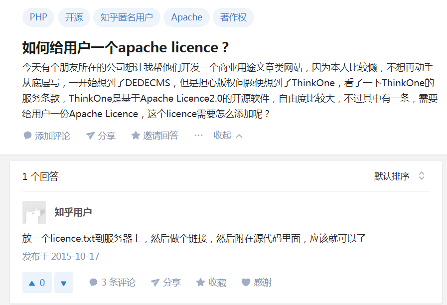

# 开源许可证的理解（License）
查看文档链接
https://gitee.com/oschina/git-osc/wikis/pages?title=License&parent=
---
```
首先对单词license和licence进行说明
- 执照license =licence
- 在美语中license是动词或名词.
- 在英语中license 是动词；licence是名词.
- drive license 驾照
- license作动词时是“获得驾照”
```
---
## Apache v2 License
```
- 开源的协议，鼓励代码共享，并且尊重作者的著作权
- 需要给用户一个Apache licence
- 如果修改了代码，就需要在代码中说明修改的内容
- 该许可是个友好的许可，只要你同样尊重之前代码作者的所有规定和声明,
  可以在基础上加上自己的许可，不过不能表现为对以上许可的修改

```



---
## MIT License
```
（软件=软体）
- 麻省理工学院条款
- 软件被授权人拥有很大的权利和很小的限制
- 软件被授权人有权复制、更改、再授权、发散、出版（权利很大）
- 在软件及其所有副本中都要有版权声明和许可声明
```
---
## GPL v2
```
- Linux采用的协议
- GPL 开源 并且不能商用（非常开源）
- 使用了GPL类库的软件，也必须是免费、开源的（传染性）
- 商用软件和有保密性要求的，就不适合用这个协议
```
---
## Artistic License 2.0
```
- 艺术许可协议
- 自由软件授权条款，主要用于官方发布的Perl解释器和大部分CPAN模块的授权
      （也不是很理解啥东西）是可随意定义的许可协议？
```
---
## BSD 2-Clause license
```
- 允许使用者修改和重新发布代码(以其他协议形式)
- 允许闭源商业发布和销售
- 发布的代码中包含源代码，则需要在源代码中必须带有源代码中的BSD协议
- 如果发布的只是二进制类库/软体，则需要在文档中和版权声明中包含原来代码中的BSD协议
```
---
## Affero GPL
```
Affero 通用公众特许条款是改自GNU通用公众特许条款，并加入额外条款，
其目的是为了Copyleft条款应用于在网络上运行的应用程式（如Web应用），
从而避免有人以应用服务提供商方式逃避GNU通用公众特许条款。
```
---
## LGPL v2.1
```
LGPL是GPL的一个主要为类库使用设计的开源协议。
和GPL要求任何使用/修改/衍生之GPL类库的的软件必须采用GPL协议不同。
LGPL允许商业软件通过类库引用(link)方式使用LGPL类库而不需要开源商业软件的代码。
这使得。
--
**采用LGPL协议的开源代码可以被商业软件作为类库引用并发布和销售
--
但是如果修改LGPL协议的代码或者衍生，则所有修改的代码，涉及修改部分的额外代码和衍生的代码都必须采用LGPL协议。因此LGPL协议的开源代码很适合作为第三方类库被商业软件引用，但不适合希望以LGPL协议代码为基础，通过修改和衍生的方式做二次开发的商业软件采用。

GPL/LGPL都保障原作者的知识产权，避免有人利用开源代码复制并开发类似的产品
```


---
